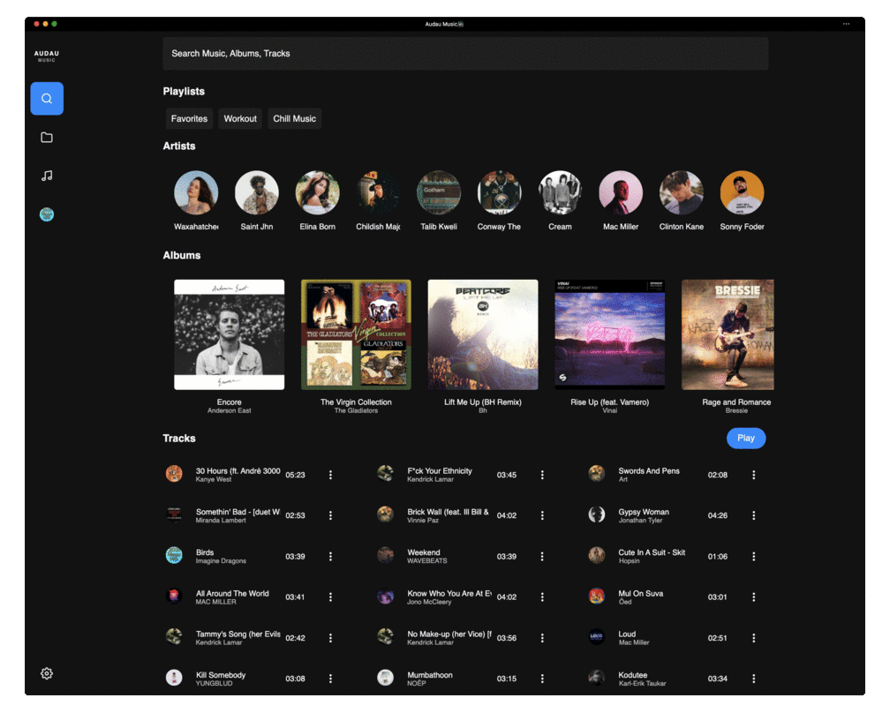

# Waveline Web / Desktop Player

## Web Version
You can try out the live version from https://player.waveline.app

This project was generated with [Angular CLI](https://github.com/angular/angular-cli) version 9.0.1.

## Development server

Run `ng serve` for a dev server. Navigate to `http://localhost:4200/`. The app will automatically reload if you change any of the source files.

## Build
Run `ng build` to build the project. The build artifacts will be stored in the `dist/` directory. Use the `--prod` flag for a production build.

## Screenshots
